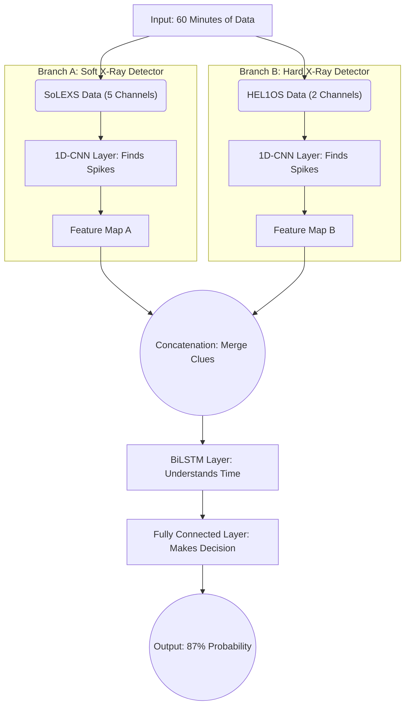

# Deep Learning Architecture: Dual-Branch 1D-CNN + BiLSTM

If you only know about CNNs (which look at images) and LSTMs (which remember sequences) from the surface, this guide will explain exactly how we combined them to predict solar flares. 

Think of predicting a solar flare like trying to predict if a volcano will erupt by watching two different seismometers. 

Here is a visual map of our neural network, followed by a beginner-friendly breakdown of what each step is actually doing.

---

### 1. Input: A 60-minute sequence of data
Imagine you are looking at a heart-rate monitor. Instead of one line, you have **7 lines** (5 from SoLEXS, 2 from HEL1OS) showing the last 60 minutes of solar activity. 
We hand this 60-minute "movie" to the neural network.

### 2. Dual-Branch CNN (Convolutional Neural Network)
Normally, a CNN is used on 2D images (like recognizing a cat). But we use a **1D-CNN** because our data is a 1D line over time. 

**What does it do?** A 1D-CNN acts like a magnifying glass sliding across the timeline. It doesn't care about the *entire* 60 minutes; it is only looking for **short, specific shapes**—like a sudden upward spike or a weird dip. 

**Why two branches?** 
SoLEXS (Soft X-rays) and HEL1OS (Hard X-rays) behave entirely differently. If we mixed them together immediately, the CNN would get confused. 
- **Branch A** becomes an expert at recognizing the shapes of Soft X-rays (the slow heating of plasma).
- **Branch B** becomes an expert at recognizing the shapes of Hard X-rays (the rapid, sudden bursts of electrons).

### 3. Concatenation (Merging)
After the CNNs have scanned their respective data, they output "Feature Maps". Think of feature maps as a list of clues:
- Branch A says: *"I saw a slow rise in the Soft X-rays 5 minutes ago."*
- Branch B says: *"I saw a massive, rapid spike in the Hard X-rays 6 minutes ago."*

**Concatenation** simply tapes these two lists of clues together into one massive list.

### 4. BiLSTM (Bidirectional Long Short-Term Memory)
CNNs are great at finding shapes (like spikes), but they have **no memory**. A CNN doesn't understand that a spike 40 minutes ago might be related to a dip right now. 

That is where the **LSTM** comes in. An LSTM is a network with a memory cell. It reads the list of clues from left to right (from minute 0 to minute 60) and builds a "story" of what is happening. 

**Why "Bi" (Bidirectional)?** 
Normally, an LSTM only reads forwards. A **BiLSTM** reads the timeline forwards *and* backwards simultaneously. 
*Imagine watching a mystery movie.* If you only watch it forwards, you might miss a clue. But if you watch it forwards, and then rewind it backwards, you understand how the ending connects to the beginning perfectly. By reading the sequence in both directions, the BiLSTM perfectly understands the long-term context of the solar activity.

### 5. Output (Fully Connected Layer)
Finally, the BiLSTM hands its "understanding of the story" to a standard Fully Connected layer (a basic neural network). 

This layer acts as the judge. It looks at the story and uses a mathematical function called a **Sigmoid**. A Sigmoid squashes any number into a clean percentage between **0 and 1**. 

* Result = `0.10` ➡️ 10% chance of a flare (Space weather is quiet).
* Result = `0.87` ➡️ 87% chance of a flare (Sound the alarm!).
